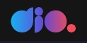

  

<h1 align='center'> Final Project Module II - HTML and CSS </h1>

	
	
	

_Para a versão em Português, clique [aqui](#portuguese)._ 

 

### Topics

- [Project description](#project-description)

- [Technologies used](#technologies-used)

- [What I learned](#what-I-learned)

- [Access the Project](#access-the-project)

 

## Project description

This repository contains the final project of module II from Course: "Developing a hamburger menu and morphing menu with CSS Transitions" from [D.I.O](https://www.dio.me/en) Bootcamp - "TQI Fullstack Developer".

 

## Technologies used

  
  

 

## What I learned

- How to animate the background using keyframes and linear-gradient;
- How to hide and show items with the visibility and opacity properties;
- How to create a hamburguer menu using CSS;
- How to create a bubble menu and hidde the menu itens using CSS.

 

## Access the Project

You can [access the project here](https://caroline-barbosa-vilar.github.io/dio-bootcamp-projeto-final-modulo-2/) 

Mobile:

Desktop:

 

<h1 align='center'> Projeto Final Módulo II </h1>

	
	
	

### Tópicos 

- [Descrição do projeto](#descrição-do-projeto)

- [Tecnologias utilizadas](#tecnologias-utilizadas)

- [O que aprendi](#o-que-aprendi)

- [Acesse o projeto](#acesse-o-projeto)
  
 

## Descrição do projeto 

Esse repositório contém o projeto final do módulo II do Curso: "Desenvolvendo um menu hamburguer e morphing menu com CSS Transitions" do Bootcamp "TQI Fullstack Developer" da [D.I.O](https://www.dio.me/en). 

 

## Tecnologias utilizadas

  
  

  
 

## O que aprendi

- Como animar o background usando keyframes e o degradê do linear-gradient;
- Como esconder e mostrar itens com as propriedades visibility e opacity;
- Como criar um menu hamburguer usando CSS;
- Como criar um menu bolha usando CSS.

 

## Acesse o projeto

Você pode [acessar o projeto aqui](https://caroline-barbosa-vilar.github.io/dio-bootcamp-projeto-final-modulo-2/) 
  

Mobile:

Desktop:

  

 

Developed with 🧡 by [me](https://www.linkedin.com/in/carolinebarbosavilar/)!
